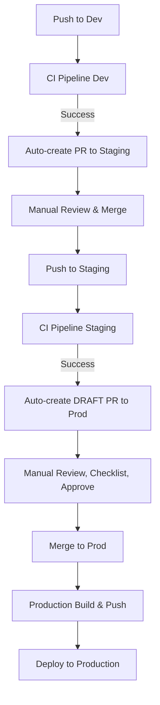

# Deployment Pipeline Overview

This document describes the automated deployment pipeline for the Finance API project.

## 🌊 Deployment Flow

```
┌─────────┐      ┌─────────┐      ┌──────────┐      ┌────────────┐
│   Dev   │ ───▶ │ Staging │ ───▶ │   Prod   │ ───▶ │ Production │
│ Branch  │      │ Branch  │      │ Branch   │      │  Deploy    │
└─────────┘      └─────────┘      └──────────┘      └────────────┘
     │                │                 │                   │
     ▼                ▼                 ▼                   ▼
  CI Tests      CI Tests          CI Tests           Docker Push
  Auto PR       Auto PR           Manual PR          & Deploy
```

## 📋 Branch Strategy

### **Dev Branch**
- **Purpose**: Active development and feature integration
- **CI Triggers**: On every push and PR
- **Auto-Promotion**: Creates PR to `staging` when CI passes
- **Protection**: Optional (recommended: require PR reviews)

### **Staging Branch**
- **Purpose**: Pre-production testing and validation
- **CI Triggers**: On every push and PR
- **Auto-Promotion**: Creates **DRAFT** PR to `prod` when CI passes
- **Protection**: Recommended (require PR reviews)

### **Prod Branch**
- **Purpose**: Production-ready code
- **CI Triggers**: On push (triggers production deployment)
- **Auto-Promotion**: None (end of the line)
- **Protection**: **REQUIRED** (require multiple reviews, status checks)

## 🔄 Workflows

### 1. **CI Pipeline (Dev)** - `ci-pipeline.yml`
**Triggers**: Push/PR to `dev`

**Steps**:
1. ✅ Linting (flake8, isort, black)
2. ✅ Unit Tests (pytest)
3. ✅ Docker Build & Integration Tests

**On Success**: Triggers `promote-to-staging.yml`

---

### 2. **Promote to Staging** - `promote-to-staging.yml`
**Triggers**: After successful CI on `dev`

**Actions**:
- Creates a PR from `dev` → `staging`
- Includes commit details and CI status
- Labels: `automated`, `staging`, `promotion`
- **Status**: Ready for review (not draft)

**Manual Step**: Team reviews and merges PR

---

### 3. **CI Pipeline (Staging)** - `ci-pipeline-staging.yml`
**Triggers**: Push/PR to `staging`

**Steps**:
1. ✅ Linting (flake8, isort, black)
2. ✅ Unit Tests (pytest)
3. ✅ Docker Build & Integration Tests

**On Success**: Triggers `promote-to-production.yml`

---

### 4. **Promote to Production** - `promote-to-production.yml`
**Triggers**: After successful CI on `staging`

**Actions**:
- Creates a **DRAFT** PR from `staging` → `prod`
- Includes comprehensive production checklist
- Labels: `production`, `release`, `critical`, `automated`
- **Status**: Draft (requires manual conversion to ready)

**Manual Steps**:
1. Review production checklist
2. Convert from draft to ready
3. Get required approvals
4. Merge to `prod`

---

### 5. **Production Build & Push** - `prod-deploy.yml`
**Triggers**: Push to `prod` branch or version tags

**Actions**:
1. Builds production Docker image
2. Pushes to Docker Hub (requires secrets)
3. Tags with `latest`, commit SHA, and semver

**Requirements**:
- `DOCKERHUB_USERNAME` secret
- `DOCKERHUB_TOKEN` secret

---

## 🛡️ Safety Features

### Dev → Staging
- ✅ Automatic PR creation
- ✅ CI must pass before PR is created
- ✅ Manual review required to merge
- ⚠️ Medium risk tolerance

### Staging → Prod
- ✅ Automatic **DRAFT** PR creation
- ✅ CI must pass on staging
- ✅ Comprehensive production checklist
- ✅ Draft status prevents accidental merge
- ✅ Multiple review requirements recommended
- 🚨 **HIGH** risk - extra caution required

## 📊 Workflow Visualization



## 🔧 Setup Instructions

### 1. Create Branches
```bash
# Create staging branch
git checkout -b staging
git push origin staging

# Create prod branch
git checkout -b prod
git push origin prod
```

### 2. Configure Branch Protection Rules

#### **Staging Branch**
- ✅ Require pull request reviews (1 reviewer)
- ✅ Require status checks to pass
  - `lint`
  - `unit-tests`
  - `docker-validation`
- ✅ Require branches to be up to date

#### **Prod Branch** (CRITICAL)
- ✅ Require pull request reviews (2+ reviewers)
- ✅ Require status checks to pass
  - `lint`
  - `unit-tests`
  - `docker-validation`
- ✅ Require branches to be up to date
- ✅ Require conversation resolution
- ✅ Include administrators in restrictions
- ✅ Restrict who can push (limit to senior devs/leads)

### 3. Add GitHub Secrets

Go to: **Settings → Secrets and variables → Actions**

Add:
- `DOCKERHUB_USERNAME`: Your Docker Hub username
- `DOCKERHUB_TOKEN`: Your Docker Hub access token

### 4. Configure Reviewers (Optional)

Edit `promote-to-production.yml` line 60-62 to add required reviewers:
```yaml
reviewers: |
  senior-dev-1
  senior-dev-2
  tech-lead
```

## 🚀 Usage

### Normal Development Flow
1. Create feature branch from `dev`
2. Make changes and push
3. Create PR to `dev`
4. After merge, CI runs automatically
5. If CI passes, PR to `staging` is auto-created
6. Review and merge to `staging`
7. After merge, CI runs on `staging`
8. If CI passes, **DRAFT** PR to `prod` is auto-created
9. Review checklist, convert to ready, get approvals
10. Merge to `prod` → triggers production deployment

### Hotfix Flow
For urgent production fixes:
1. Create branch from `prod`
2. Make fix
3. Create PR directly to `prod`
4. After production deployment, backport to `staging` and `dev`

## 📝 Best Practices

1. **Never skip staging**: Always test in staging before production
2. **Use the checklist**: Complete all items in production PR checklist
3. **Communicate**: Notify team before production deployments
4. **Monitor**: Watch logs and metrics after deployment
5. **Document**: Keep release notes updated
6. **Rollback ready**: Have a rollback plan for every deployment

## 🔍 Troubleshooting

### PR not auto-created?
- Check if CI pipeline succeeded
- Verify workflow permissions in repository settings
- Check Actions tab for workflow run logs

### CI failing?
- Review the specific step that failed
- Check environment variables are set correctly
- Verify Docker build succeeds locally

### Can't merge to prod?
- Ensure all required reviews are approved
- Verify all status checks passed
- Check branch protection rules are satisfied

## 📚 Additional Resources

- [GitHub Actions Documentation](https://docs.github.com/en/actions)
- [Branch Protection Rules](https://docs.github.com/en/repositories/configuring-branches-and-merges-in-your-repository/managing-protected-branches/about-protected-branches)
- [Docker Hub Documentation](https://docs.docker.com/docker-hub/)

---

**Last Updated**: 2025-12-09
**Maintained by**: DevOps Team
